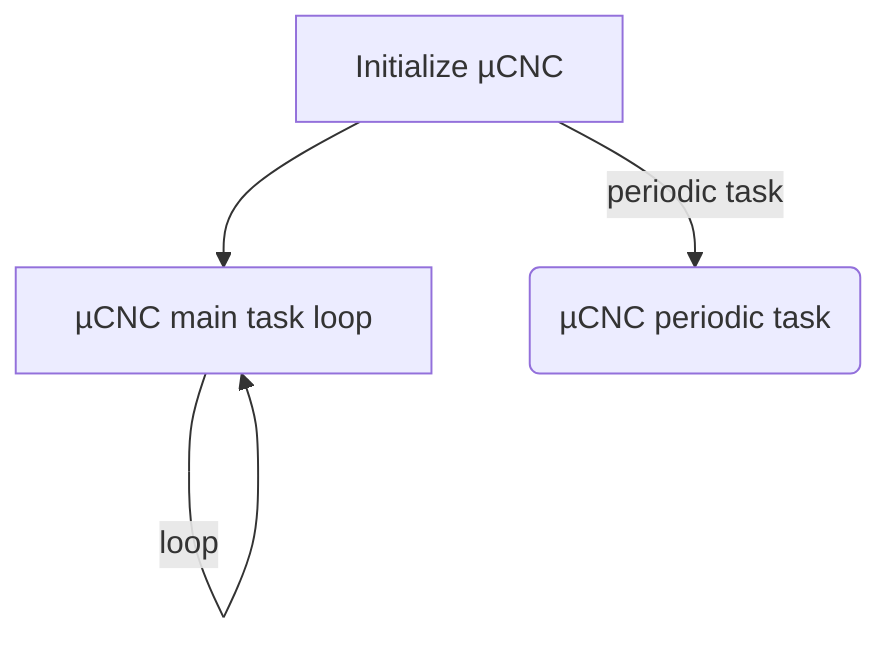
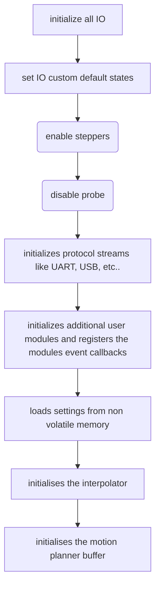
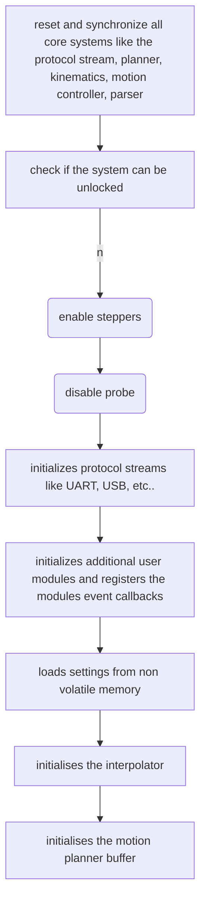

<p align="center">

</p>


# µCNC
µCNC - Universal CNC firmware for microcontrollers

## Configuration

### cnc_config.h
This file contains a set of basic configurations that can be set to fit the needs of a board or custom setup.

### cnc_hal_config.h
This file contains a set of advanced configurations regarding the machine HAL, like Tools, encoders, PID controllers dual drived axis.

An alternative way to configure µCNC is to make use of the `boardmap_overrides.h` and `cnc_hal_overrides.h`
In these files you are able to undo an existing configuration and set a new value as the values in these files will be included later and allow these types of overrides.
These 2 files exist only for this purpose. They (most likelly) never be changed in the project repo for this matter allowing the user to create a branch and place their modifications safelly on these files.

These files are also target by the [µCNC config builder web tool](https://paciente8159.github.io/uCNC-config-builder/) to patch the necessary user modifications.

## µCNC internal logic

µCNC will run macro code excution for most architectures is like this:



### Initialize µCNC

On the initialization the code initializes and configures all necessary IO and then it starts loading all sub-systems one by one:



### µCNC main loop

On the main loop µCNC will perform the following tasks:



```
flowchart TD;

A[enter loop] --> B{startup reset?}

%% --- RESET SUBPROCESS ---
subgraph SG_RESET [cnc_reset]
    C1[reset system state]
    C2[clear alarms]
    C3[reset planner and motion]
    C4[reset protocol streams]
    C1 --> C2 --> C3 --> C4
end

B -->|yes| C1
C4 --> D[set unlock state]
D --> A

%% --- UNLOCK SUBPROCESS ---
B -->|no| E{unlock state?}
E -->|yes| F1

subgraph SG_UNLOCK [cnc_unlock]
    F1[check if unlock allowed]
    F2[validate machine state]
    F3[check alarms]
    F4[return unlock result]
    F1 --> F2 --> F3 --> F4
end

F4 --> G{unlock ok?}
G -->|yes| H[set running state]
H --> A
G -->|no| I[stay unlock or fault]
I --> A

%% --- RUNNING SUBPROCESS ---
E -->|no| J{running state?}
J -->|yes| K1

subgraph SG_TASKS [cnc_dotasks]
    K1[run planner step]
    K2[run motion step]
    K3[run parser]
    K4[run modules]
    K5[process realtime commands]
    K1 --> K2 --> K3 --> K4 --> K5
end

K5 --> A

%% --- FAULT SUBPROCESS ---
J -->|no| L{fault state?}
L -->|yes| M1

subgraph SG_FAULT [fault handling]
    M1[process protocol]
    M2[process realtime]
    M3[update exec state]
    M4[update alarms]
    M1 --> M2 --> M3 --> M4
end

M4 --> N{recoverable?}
N -->|yes| D
N -->|no| O[require reset]
O --> A

%% --- REQUIRE RESET SUBPROCESS ---
L -->|no| P{require reset?}
P -->|yes| Q1

subgraph SG_REQRESET [wait for reset]
    Q1[wait for soft reset]
    Q2[on reset call cnc_init]
    Q1 --> Q2
end

Q2 --> C1

P -->|no| R[force require reset]
R --> O

```
